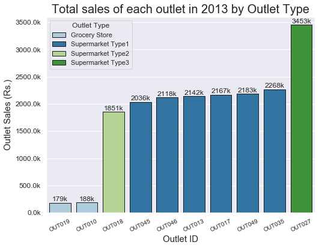
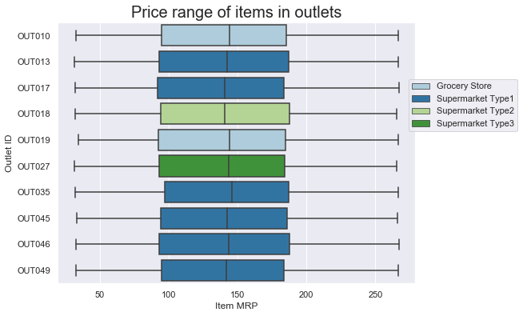
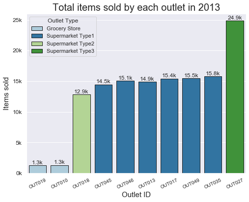
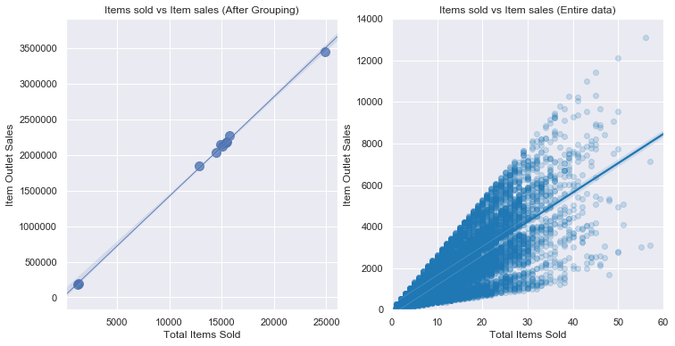
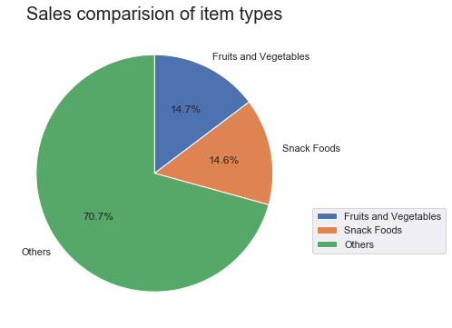

# Data Analysis and Visualization on Big Mart Sales in 2013
## by Bhavesh Parvatkar

## Dataset

BigMart has collected 2013 sales data for 1559 products across 10 stores in different cities. Also, certain attributes of each product and store have been defined. 

The data has been collected from the following link: https://datahack.analyticsvidhya.com/contest/practice-problem-big-mart-sales-iii/

**Data Dictionary**

| Column name               | Description |
| ------------------------- | --------------------------------------- |
| Item_Identifier           | Unique product ID       |
| Item_Weight               |   Weight of product        |
| Item_Fat_Content          | Whether the product is low fat or not        |
| Item_Visibility           | The % of the total display area of all products in a store allocated to the particular product        |
| Item_Type                 | The category to which the product belongs        |
| Item_MRP                  | Maximum Retail Price (list price) of the product        |
| Outlet_Identifier         | Unique store ID        |
| Outlet_Establishment_Year | The year in which store was established        |
| Outlet_Size               | The size of the store in terms of ground area covered        |
| Outlet_Location_Type      | The type of city in which the store is located        |
| Outlet_Type               | Whether the outlet is just a grocery store or some sort of supermarket        |
| Item_Outlet_Sales         | Sales of the product in a particular store. This is the outcome variable to be predicted.        |

**Data Wrangling**

Some of the Data Wrangling that has been performed on this dataset are:
1. Filling NA values in outlet type and item weight
2. Replacing 0 vales in item visibility with mean of particular item type
3. Fixing spelling errors and different notation of values in item fat content column
4. Adding new columns such as how many products have been sold, since how many years the outlets have been running

## Summary of Findings

**Insights on Tier**

Having an outlet in the higher Tier doesn't mean that they will have higher sales. Tier 3 had more outlets however Tier 2 made most sales. Even Tier 1 has the same amount of outlets as in Tier 2 but Tier 2 had more items in their inventory. As the price range is almost similar in all the Tiers the competition rises in selling maximum items. 

The main reason for Tier 2 to have the highest sales was that they had only Supermarket Type 1 type outlets whereas others had Grocery Stores and Supermarket Type 2 and 3. 

**Insights on Outlets**

The type of outlet does have a significant impact on sales. The sales showed the following trend:

 Supermarket Type 3 > Supermarket Type 1 > Supermarket Type 2 > Grocery Store

Outlet 27 had the highest number of items and even had the highest sales which made them the most successful outlet in 2013 with total sales of 3.4 million. Although it is of just medium size it is the only outlet of Supermarket Type 3. 

Doesn't matter if the outlet is newly established or not. If they have more items and price range which can compete with other outlets than surely they will have better sales. For example, Outlets 19 and 27 were established in the same year yet 19 made the least sales, and 27 made the highest sales. 

**Insights on Items**

The total items sales and total items sold showed a positive linear trend. As prices were similar in every outlet, the sole competition was in selling the maximum number of items.

Food and Vegetables and Snack Foods were the most sold items.  

Supermarket Type outlets didn't have more than 0.20% item visibility. Only Grocery Stores were able to cross the mark of 0.20%.

## Key Insights for Presentation

> Select one or two main threads from your exploration to polish up for your presentation. Note any changes in design from your exploration step here.

### **1. Total sales of each outlet by outlet type in 2013**

**Key Findings**
1. The sales of the outlets were depending on the type of outlet in the following order:

    Supermarket Type 3 > Supermarket Type 1 > Supermarket Type 2 > Grocery Store

| Outlet type | Sales Contribution |
| ----------- | ------------------ |
| Supermarket Type 3 | 18% |
| Supermarket Type 2 | 10% |
| Supermarket Type 2 | 11% - 12% |
| Grocery Store      | 1% |

### 2. **Competitve price range**

As the outlets had almost a similar price range, the outlet which sells the highest items became the key leader in sales.

**Price range of each outlets**

### 3. **The more items are sold, the more is the sales**
The items sold per each outlet are similar to item sales which shows that we might see a linear relation between item sales and total items sold.

**Items sold by each outlet**

We can see the relation between the items sold and the items sales in the scatter plot below. They showed a correction of 0.75 

**Relation between items solds and items sales**

### 4. **Fruits, Vegetables and Snack Food**

Fruits and Vegetables and Snack Foods are the most sold items and generated sales of 28% collectively.

