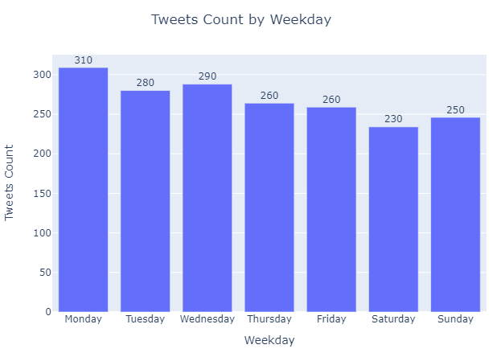
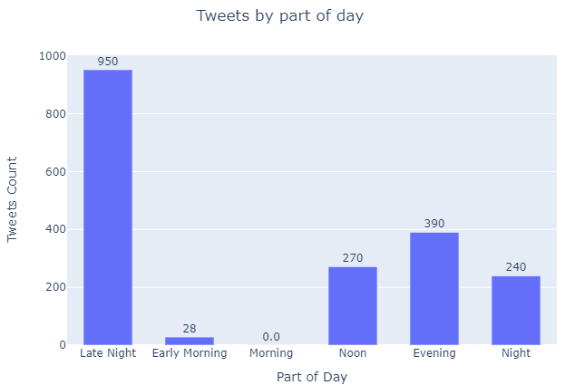

# Wrangling and Analyzing WeRateDogs tweets data using Twitter API
## by Bhavesh Parvatkar

## Dataset
The dataset was generated using Twitter API by fetching tweets of WeRateDogs.

Find the complete report on data wrangling in the [Data wrangling report](wrangle_report.pdf).

## Report 

Highlights on some of the findings is given below. For detailed findings, read the report [Final report](act_report.pdf).

1. WeRateDogs is most active on weekends.

2. Most of the tweets are made during 12 am to 4 am.

3. From March 2016, WeRateDogs has tweeted less than 50 time per month.

4. The top 10 retweets count contributed to 7.29% of retweets WeRateDogs ever received.